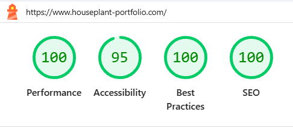
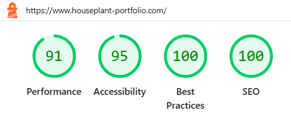

# Houseplant E-commerce (Full-Stack Portfolio)

## Project Overview
<div>
  
</div>

#### Houseplant E-commerce is a full-stack portfolio project that demonstrates a complete online shopping experience, including authentication, payments, and cloud storage.

| Live Site | Project Duration | Status |
| :--- | :--- | :--- |
| [houseplant-portfolio.com](https://www.houseplant-portfolio.com) | Oct 2025 – Mar 2026 | Deployed and Maintained |

---

## Technical Stack

This project was developed independently, covering design, frontend, and backend development.

| Category | Tools & Technologies |
| :--- | :--- |
| **Frontend** | Next.js, React, Tailwind CSS |
| **Backend** | NestJS, Prisma, PostgreSQL |
| **Cloud & Infrastructure** | AWS EC2, AWS RDS, AWS S3 |
| **Storage (Dev/Test)** | MinIO |
| **Authentication** | Google OAuth 2 |
| **Payments** | Stripe |
| **External APIs** | Google Maps API |
| **Design** | Figma |
| **DevOps & Tools** | Docker, Git, GitHub |
| **Deployment** | Vercel (Frontend), AWS EC2 (Backend) |

---

## Engineering & DevOps Deep Dive

This project focuses on building a production-ready environment with an emphasis on security, performance, and automated validation.

### Frontend & UX Optimization (Next.js & Vercel)
* **Automated Image Pipeline:** Leveraged `next/image` to utilize Vercel’s Edge network for real-time resizing and WebP conversion. This optimized the delivery of high-resolution plant imagery, significantly improving **LCP (Largest Contentful Paint)**.
* **Edge Runtime Middleware:** Implemented lightweight middleware on Vercel Edge nodes to intercept server-side requests with minimal latency.
* **Silent Token Refresh:** The middleware communicates with the **NestJS backend** to verify session validity. If the Access Token is expired, it triggers an automatic refresh and updates the session seamlessly, ensuring an uninterrupted user experience (UX) during checkout.

#### Performance Metrics (Lighthouse Score)

* **Lighthouse desktop score:**
<div>
  
</div>


* **Lighthouse mobile score:**
<div>
  
</div>
By optimizing the critical rendering path and image delivery, the application achieves a **Performance score of 90+**, with **Accessibility, Best Practices, and SEO at a perfect 100**. This ensures a fast and inclusive experience for all users.

---

### Backend Security & Data Integrity (NestJS & Prisma)
* **Secure Auth Strategy:** Managed JWTs exclusively through **HTTP-only and Secure cookies** to mitigate XSS risks.
* **Encrypted Connectivity:** Configured **AWS RDS (PostgreSQL)** with SSL/TLS encryption, ensuring all database traffic is encrypted between the EC2 instances and the RDS cluster.

### CI/CD & Deployment Strategy (GitHub Actions & Docker)
* **Automated E2E Testing (API-Level):** Integrated a testing suite using **Vitest** and **PactumJS** into the GitHub Actions pipeline. Every `push` to the backend triggers a full validation of critical business logic (Auth, Cart, and Payments) against a live PostgreSQL container.
* **Continuous Integration (Docker Hub):** To ensure deployment reliability, a new **Docker image** is built and pushed to **Docker Hub** *only* if all E2E tests pass successfully. This guarantees that the registry always contains a "Known Good" version.

---

## Database Design & Data Lifecycle
I designed a relational database schema using PostgreSQL and Prisma ORM, focusing on data integrity and the transition from volatile shopping sessions to immutable order records.

### Entity Relationship & Strategy
* **User ↔ Cart (1:1):** Each user is assigned a unique cart instance upon registration to manage persistent shopping sessions.

* **Cart ↔ CartItem (1:N):** Allows multiple products to be added to a single cart with specific quantities.

* **User ↔ Order (1:N):** Maintains a comprehensive purchase history for each customer.

* **Order ↔ OrderItem (1:N):** Captures a point-in-time snapshot of purchased products.

### Transactional Order Processing (Cart to Order)
The core of the e-commerce engine lies in the secure conversion of CartItem data into OrderItem records. I implemented this using Prisma Transactions to ensure atomic operations:

* **Double-Layer Inventory Validation:**
    * **Pre-Check (Cart Level):** Real-time stock availability is verified when a user adds an item to their cart, providing immediate feedback and preventing invalid selections.
    * **Final-Check (Payment Level):** A second, mandatory stock verification occurs upon receiving the **Stripe Webhook** confirmation. This ensures inventory is still available even if other users purchased the same item during the checkout window.
      
* **High-Concurrency Inventory Control (Optimistic Locking):** To prevent race conditions during simultaneous orders, I implemented **Optimistic Locking using a version field**. The system updates the stock only if the `version` matches the one retrieved at the start of the transaction. If a conflict occurs (meaning another process updated the record), the transaction fails gracefully, preventing overselling and ensuring strict data integrity.

* **Atomic State Transition:** Upon a successful payment_intent.succeeded event, the system executes a Database Transaction to update the order status to PAID and decrement product stock via Version-based Optimistic Locking. This transaction ensures that inventory is only reduced if the version matches and the quantity is available; once this atomic operation completes without error, the system subsequently clears the user's cart.

* **Price Snapshotting:** Unlike CartItems which dynamically reference live product prices, OrderItems capture and store the exact price at the moment of the transaction. This safeguards historical financial records against future product price updates or deletions.

---

## Technical Decision Making

Rather than simply implementing features, I focused on making architectural choices that enhance security and user experience.

### 1. Hybrid Hydration for Zero-Flicker Auth
* **Problem:** A brief "logged-out" state was visible during the initial client-side hydration.
* **Decision:** I implemented a hybrid approach using **Server-Side Pre-fetching** combined with a refined **Zustand State Machine**. By distinguishing between `undefined` (initial), `null` (logged-out), and `Array` (data loaded), the application utilizes server-provided data as a bridge until the client store is ready, ensuring a seamless UI from the first frame.

```tsx
// Header.tsx - Hybrid Hydration Logic
export default function Header({ initialCart }: { initialCart: CartItem[] | null }) {
  const cartItemsArray = useCartItemStore((state) => state.cartItemsArray);

  // Logic: Use pre-fetched server data ONLY when the client store is in its initial 'undefined' state.
  // Once the store updates (to null or an Array), the client-side state takes precedence.
  const cartItems = cartItemsArray !== undefined ? cartItemsArray : initialCart;
```

### 2. Branding Consistency via Stripe Payment Intent
* **Problem:** The default Stripe Checkout redirected users away from the site, breaking the brand experience.
* **Decision:** Migrated to the **Stripe Payment Intent API** to handle transactions within the application's own UI. This allowed for full CSS control and a unified checkout flow, which is critical for maintaining user trust in e-commerce.

### 3. Hardening OAuth2 Security
* **Problem:** Standard OAuth2 redirects often expose sensitive tokens in URL parameters.
* **Decision:** Re-architected the callback flow to handle all token exchanges via **HTTP-only Cookies** on the server side. This eliminates token exposure in browser history and protects against XSS-based theft.
// ...
}

---

## Key Features & Page Breakdown

### Authentication (Login / Signup)
- Secure authentication using JWT stored in HTTP-only cookies to prevent XSS attacks, with the Secure flag enabled for HTTPS transmission
- Google OAuth2 login integration
- Persistent login with refresh token strategy

### Product Browsing
- Browse houseplant products with optimized image loading
- Dynamic product pages with detailed information

### Cart System
- Add/remove items and manage quantities
- Real-time cart updates with backend synchronization

### Checkout & Payment
- Secure checkout process integrated with Stripe
- Payment intent handling and order confirmation flow

### Order Management
- Track user orders and purchase history
- Backend order processing with database persistence

### Image Upload & Storage
- Image upload and delivery via AWS S3
- Unique file naming strategy to prevent predictable access

### Address Search
- Address lookup using Google Maps API
- Improved user experience for shipping information

